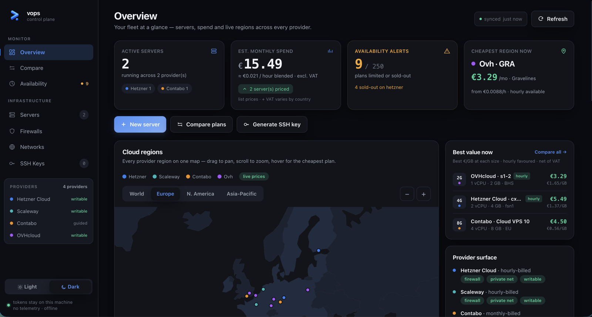

<h1 align="center">
  <br>
  vops
</h1>

<p align="center">
  <strong>Local-first VPS operations.</strong>
</p>
<p align="center">
  <em>Compare cloud providers on real-time prices, then provision and manage them safely — entirely from your machine.</em>
</p>
<p align="center">
  <a href="LICENSE"></a>
  <a href="https://www.npmjs.com/package/@flui-cloud/vops"></a>
  <a href="https://nodejs.org"></a>
</p>
<p align="center">
  <strong><a href="https://vops.flui.cloud">Compare providers online →</a></strong><br>
  <em>No install, no account — the same live prices vops uses, in your browser.</em>
</p>
<p align="center">
  <em>Part of the <a href="https://github.com/flui-cloud">Flui</a> ecosystem. Built on <a href="https://www.npmjs.com/package/@flui-cloud/infra"><code>@flui-cloud/infra</code></a>.</em>
</p>

<p align="center">
  
</p>

`vops` is a command-line tool and a local web dashboard for working with cloud VPS providers. It compares providers side by side on **live pricing and capabilities**, then lets you plan, provision and manage servers, firewalls, private networks and SSH keys through one uniform interface — whether the provider is Hetzner, Scaleway, Contabo or OVH.

Everything runs on your own machine. Your provider tokens never leave it, there is no account to create, and nothing is sent anywhere — the local dashboard is served on `127.0.0.1` only. The one opt-in exception is `vops watch` (below): since your laptop can't push a notification to your phone while it's asleep, watch alerts are relayed through a small hosted service you connect to explicitly — no email, no signup, just a token generated on your machine.

## Who it's for

You run a handful of servers on Hetzner, Scaleway, Contabo or OVH — not a fleet of five hundred behind a managed platform. You're fine on the command line, you don't want another SaaS account, and you're not writing Terraform to spin up a box for the weekend. vops gives you real prices and safe provisioning across all four without any of that ceremony.

## Why vops

Every cloud provider has a different console, a different pricing page, a different API and a different idea of what a "firewall" or a "private network" is. Comparing them honestly is tedious, and provisioning across them means learning each one.

vops gives you a single vocabulary over all of them, with a bias toward **safety**:

- **Real prices, not brochure prices.** OVH pricing comes straight from the live public catalog; comparisons reflect what you'd actually pay.
- **It won't spend your money by accident.** Provisioning is gated to hourly-billed resources, and destructive actions only ever touch resources vops itself created (named `vops-*` or tagged `managed-by=vops`).
- **Provider-neutral where it counts.** A host-level firewall you can carry across providers that lack a usable native one.
- **Your secrets stay yours.** Tokens are read from local config; SSH private keys never leave your disk, even when you "import" an existing key.

## Quickstart

Requires Node.js 20+. No account, no Docker, **no credentials**.

```bash
# 1. Install
npm install -g @flui-cloud/vops

# 2. See who's supported and how each one bills
vops providers list

# 3. Real OVH prices, straight from the public catalog
vops compare --provider ovh

# 4. Open the local dashboard (interactive map, 127.0.0.1 only)
vops ui
```

Every step above runs with no token at all — nothing to configure, nothing sent anywhere. Rendering a host firewall (`vops host-firewall render`) works cold too.

Comparing *across* providers is the exception: `vops compare` without `--provider` queries each provider's own API, so it needs their credentials. OVH is the one whose catalog is public, which is why it answers cold. Add a credential when you want that, or when you want vops to see your fleet or provision something — see [Configuration](#configuration).

## What you can do

```bash
# Research — no provisioning, safe to run anytime
vops providers list                    # supported providers + billing model
vops providers plans ovh               # live plans & prices for a provider
vops providers regions hetzner         # regions / locations
vops providers capabilities scaleway   # what the provider supports
vops compare                           # side-by-side comparison across providers

# Servers — plan first, then create (hourly-billed only)
vops servers plan --provider hetzner --plan cx22 --region nbg1
vops servers create <plan-file>        # provisions; monthly-commitment providers are refused
vops servers list
vops servers delete <id>               # only vops-created servers

# Firewall (provider-native, where supported)
vops firewall create / list / show / rules / apply / delete

# Host-level firewall (provider-independent, via cloud-init)
vops host-firewall render <plan>       # emit the nftables ruleset
vops host-firewall cloud-init <plan>   # emit #cloud-config user_data

# Private networks
vops vnet create / list / show / subnet / route / attach / delete

# SSH keys (private half never leaves your machine)
vops ssh-key create / list / import / register / delete
vops ssh <provider> <server>           # open an interactive session

# Day-2 operations over SSH — on any host, whoever provisioned it
vops host add / import / list / show   # local inventory (never touches the server)
vops host status                       # live health: CPU, memory, disk, I/O, services
vops host update --list                # which packages are pending (read-only)
vops host update                       # apply them
vops host firewall                     # one firewall model: provider-native or vops nftables
vops host ssh-harden                   # key-only SSH, lock-out-proof (see below)

# Benchmark — measured performance per euro
vops bench host <name>                 # preflight only; add --yes to actually run
vops bench list / show <id>            # stored runs; --share emits a markdown artifact
vops bench compare <a> <b>             # self-relative deltas, caveats always shown

# Watch — get alerted while you're away (opt-in, hosted relay)
vops watch login                                              # connect once (local token, no signup)
vops watch plan add hetzner cx53 --location fsn1 --ntfy-topic my-vops-alerts
vops watch uptime add <url>            # external black-box uptime probe
vops watch host add <name>             # dead-man monitor: alerts when the host goes silent
vops watch list
vops watch feed --follow               # live feed of stock/price transitions
vops watch remove <id>

# Local dashboard
vops ui
```

## Highlights

- **Providers.** Hetzner and Scaleway (hourly, native firewalls); **Contabo** (monthly billing — vops *guides* you through creation but never commits you to a monthly plan); **OVH** via **OpenStack** (Keystone + Nova + Neutron + Glance, where a single credential spans every region through the service catalog).
- **Real-time pricing.** OVH's public catalog needs no credentials and drives an interactive **world map** home view with pan/zoom across every region.
- **Safe provisioning.** `plan → create → delete`. Creation is gated to hourly billing; deletes and destructive mutations are refused on anything vops didn't create.
- **Two firewalls, one model.** Use the provider's native firewall where it's good (Hetzner, Scaleway), or a **host-level nftables firewall** delivered through cloud-init for providers that lack one (Contabo, OVH). The host firewall is lock-out-safe — it keeps SSH reachable unless you've explicitly opened port 22 yourself.
- **Private networks.** Create networks and subnets and attach servers to them (OVH/Neutron today).
- **SSH by reference.** Manage local `ed25519` keys, or *import* a key you already use — vops records its path and never copies the secret — then register the public half with a provider.
- **Day-2 operations on any host.** `vops host` works over plain SSH against servers vops never provisioned — live health, pending updates, hardening. `vops host ssh-harden` disables password login lock-out-proof: it refuses unless your own key is proven to work and no other password user remains, then auto-reverts if the new config locks you out.
- **Measured performance per euro.** `vops bench` runs a versioned benchmark battery over SSH and stores the result locally. It reports self-relative deltas with caveats attached, never a league table — and it won't run without `--yes`, since saturating a box for minutes is disruptive.
- **Get pinged when a plan restocks.** `vops watch` alerts you the moment a sold-out plan comes back or its price moves, over ntfy, a webhook, or Telegram — plus external uptime probes and a dead-man monitor that speaks up when a host goes silent. It's the one feature that isn't purely local — see above for exactly what that means.

## The local dashboard

`vops ui` starts a NestJS/Express server bound to `127.0.0.1` and guarded by a one-time session token, then opens a single self-contained **Alpine.js + Tailwind** page (assets inlined, fully offline, no CDN). The dashboard calls the same services as the CLI, so both are always in sync — there is no second source of truth.

## Configuration

Credentials and local state live under `~/.config/vops/`. There are two ways to supply a provider credential — pick one:

```bash
vops config set hetzner YOUR_HETZNER_TOKEN   # encrypted local store (recommended)
vops config list                             # which providers are configured
```

- `~/.config/vops/profiles/<profile>/secrets.json.enc` — where `vops config set` stores credentials, encrypted with **AES-256-GCM**. The key sits beside it in `.key`, created `0600`.
- `~/.config/vops/.env` — the environment-variable route, read directly (a `.env` in the current directory works too). Plain text, so it's on you to protect it.
- `~/.config/vops/profiles/<profile>/keys/` — your SSH keys (private halves stay here, never uploaded, never copied on import).
- A local libSQL cache and a plan/audit store.

Provider credential variables, if you use the `.env` route:

| Provider | Variables |
| --- | --- |
| Hetzner | `HETZNER_TOKEN` |
| Scaleway | `SCALEWAY_*` |
| OVH (OpenStack) | `OS_*` (Keystone auth — one credential, all regions) |
| Contabo | `CONTABO_CLIENT_ID`, `CONTABO_CLIENT_SECRET`, `CONTABO_API_USER`, `CONTABO_API_PASSWORD` |
| Cherry Servers | `CHERRY_API_KEY`, `CHERRY_PROJECT_ID` (+ `CHERRY_IMAGE` for provisioning — image slugs are per-plan) |

Secrets are read locally and are **never** printed to logs or `--json` output.

## Development

vops depends on **[`@flui-cloud/infra`](https://www.npmjs.com/package/@flui-cloud/infra)** for all provider/cloud logic, installed from npm. That package is the single source of truth for the provider layer and evolves there, not here.

```bash
pnpm install                     # installs @flui-cloud/infra from npm
npx tsc && npx tsc-alias         # compile src → lib/
node scripts/build-map.js        # bake the offline world map (d3-geo)
node scripts/build-ui.js         # Tailwind purge + inline Alpine → lib/ui, lib/lib
pnpm test                        # jest
node bin/run <command>           # run the built CLI without touching the global link
```

- **Full local loop:** `npx tsc && npx tsc-alias && pnpm test`. For UI/asset changes also run the two `build-*.js` scripts.
- To work against a local checkout of `@flui-cloud/infra`, point the dependency at it (`file:../flui-infra`) and rebuild it there after each change. Re-run `pnpm install` here **if files were added or removed** — pnpm hard-links `file:` deps at install time, so the copy goes stale otherwise.
- The stack is TypeScript — [oclif](https://oclif.io) for the CLI, NestJS for dependency injection and the local API.

## License

vops is released under the [Apache License 2.0](LICENSE).

---

<p align="center">
  <em>Built and maintained by <a href="https://gojodigital.com/">Dawit</a>.</em>
</p>
